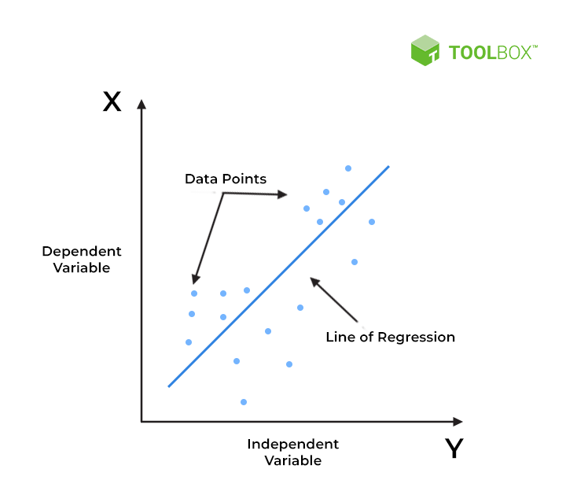
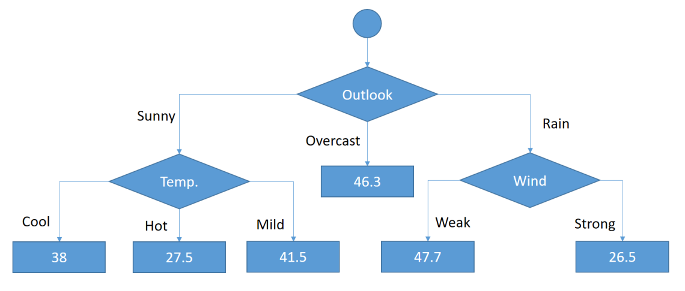
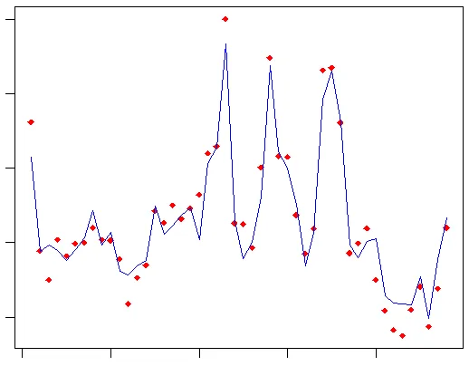

# Regression algorithms  

In machine learning, whether supervised or unsupervised, models are divided into two further categories: regression or classification.  
A classification algorithm seeks to predict the part of a ‘group’, whereas a regression algorithm seeks to predict a numerical value.  

## 3 Regression algorythms

### Linear Regression
Linear Regression is one of the simplest regression algorithms. It assumes a linear relationship between the input variables (features) and the output variable. The goal is to find the best-fitting line through the data points. It can be represented with the best linear function that create a linear output depending of any input.  

It is easy to understand and interpret and pretty good for datasets with a linear relationship between input and output.  
However it assumes a linear relationship which is sensitive to outliers.  

### Decision Tree Regression
A Decision Tree Regression algorithm builds a model in the form of a tree, where each node represents a decision based on a feature's value. The tree recursively splits the data into subsets to predict the output. It is the algorytmh that matchs the best the "human decision making process". The dataset is split into smaller and smaller subsets based on features that reduce variance (or another metric like mean squared error). At the end, the leaves of the tree represent the predicted values.

It can model non-linear relationships and it is also pretty easy to interpret and visualize. It handles both numerical and categorical data.
However it prone to overfitting, especially with deep trees and is sensitive to small changes in the data (can lead to different splits).  

### Support Vector Regression (SVR)
Support Vector Regression (SVR) is an extension of Support Vector Machines (SVM) that can predict continuous values. SVR tries to fit the best line (or hyperplane) within a margin of tolerance, rather than minimizing the prediction error directly. SVR uses kernel tricks to capture complex relationships between the input features and the target.
It is very effective in high-dimensional spaces and can model non-linear relationships through kernels.
However it is more complex and computationally expensive, which requires careful tuning of parameters.  

